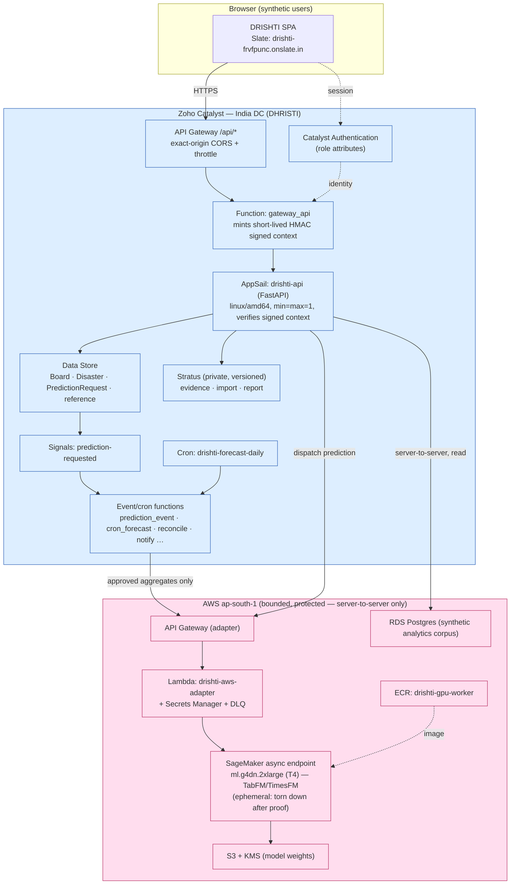

# DRISHTI — Final Architecture (Prompt 25)

> **Synthetic Karnataka-Police hackathon demonstration on Zoho Catalyst — never production.**
> Catalyst hosts the public app + operational serving/object data; a bounded, protected AWS
> plane runs the justified custom ML (TabFM/TimesFM) and holds the large synthetic analytics
> corpus. The browser never reaches AWS/RDS or any database directly.

Project **DHRISTI** `48361000000030003` · org `60075362708` · India DC.

## 1. System architecture



**Boundary invariants**
- Browser → **API Gateway** only; never AppSail/AWS/RDS directly. Enforced by the route/data-boundary checker (336 routes, 0 violations) + `check_no_db_url_in_web` (270 web files, 0 leaks).
- AppSail **rejects** any non-health request lacking a valid signed gateway context (verified live: direct `/cases` → 401).
- AWS is reached **only** server-to-server through the protected adapter; approved **aggregate** inputs only (no raw evidence / FIR narratives / person attributes).

## 2. Authenticated request flow (and the current demo deviation)

```mermaid
sequenceDiagram
  participant B as Browser
  participant GW as API Gateway
  participant G as gateway_api
  participant A as AppSail
  participant D as Data Store / RDS
  B->>GW: GET /api/cases (Catalyst session)
  GW->>G: forward (+ Catalyst identity)
  G->>G: resolve role+scope SERVER-SIDE; strip client identity headers
  G->>A: forward + X-DRISHTI-Context (HMAC, aud, exp, nonce)
  A->>A: verify signature/audience/expiry/replay; re-validate role
  A->>D: scoped query (server-enforced authorization)
  D-->>A: rows (scope-limited)
  A-->>B: JSON (via GW)
  Note over G: DEVIATION (demo): DRISHTI_DEMO_AUTH=true currently mints a<br/>super_admin context for sessionless callers. Must be OFF for a<br/>secure live demo (POST_HACKATHON_BACKLOG RB-1).
```

## 3. Prediction / forecast flow (Catalyst ↔ AWS)

```mermaid
sequenceDiagram
  participant A as AppSail
  participant DS as Data Store
  participant S as Signal
  participant PE as prediction_event
  participant ADP as AWS adapter (API GW+Lambda)
  participant SM as SageMaker T4 (TabFM/TimesFM)
  A->>DS: upsert PredictionRequest (state=approved) [persist-before-emit]
  DS->>S: row inserted (state==approved)
  S->>PE: prediction-requested (Instant)
  PE->>ADP: dispatch (idempotency key; approved aggregates only)
  ADP->>SM: invoke (real CUDA T4)
  SM-->>ADP: result (+ backend/device/artifact-digest)
  ADP-->>A: persist result; state=dispatched
  Note over SM: Ephemeral endpoint, torn down after proof.<br/>Fail-closed on missing CUDA/weights/licence/schema.
```

## 4. Documented deviations (honest)

| Deviation | Why | Guardrail | Backlog |
|---|---|---|---|
| **DATABASE_URL on AppSail** (Prompt 23 Option A) — RDS server-to-server for not-yet-migrated crime-domain CRUD | Live-demo completeness over a full Data Store migration | Synthetic DB (boot-time marker), RLS off by explicit request, browser never reaches RDS; DB-free **boot** still holds | Migrate crime-domain WRITES to Data Store |
| **DRISHTI_DEMO_AUTH=true** on `gateway_api` | Role-card demo shows live data without an interactive IAM login per judge | Data is synthetic; server-side authz logic is real + offline-tested (34-case matrix) | **RB-1** (turn off; real Catalyst Auth + 6 users) |
| **RLS/FORCE RLS disabled** | Explicit synthetic-hackathon decision | Server-side role/scope authorization is mandatory | **SEC-1** |
| **Zia speech / QuickML** | Not available / not enabled in IN DC | Browser Web Speech (labelled); labelled deterministic planner | DATA-2 / RB-2 |

## 5. Local ↔ live parity

- Strict local release gate (`scripts/release_gate.py`, 16 gates) mirrors the pipeline validate/build/security stages 1:1.
- AppSail image is `linux/amd64`, non-root (`appuser`), port 9000, health `/health/live` + `/health/ready`.
